# Repository for Nuclei Segmentation for Histopathology Images

<p align="center">Note: If you're interested in using it, feel free to ⭐️ the repo so we know!</p>

## Datasets

## Patch Generation
Patch Generation has been done in offline mode to reduce pipeline complexity. The proposed approach uses multiple dataset therefore the size of WSIs are non-standard. Where as the pathches generated from WSIs have dimensions of 256x256x3 having 75% overlap among them. 

## Models
The purpose of this pipeline was to explore and train various nuclei segmentaion datasets therefore we used Modified U-Net for training.
### U-Net


## Pre-Trained Models
The Pre-Trained models can be downloaded from [google drive](https://drive.google.com/drive/folders/1g5SdbW8q1Z0e9dk6cW431JO01BDq4g0H).

## Installation
To get this repo work please install all the dependencies using the command below:
```
pip install -U segmentation-models
pip install -r requirments.txt
```

## Training 
To start training run the Train.py script from the command below. For training configurations refer to the [Training File](./Train.py) file. You can update the file according to your training settings. Model avaible for training is U-NET.
```
 python Train.py
```

## Testing
To perfrom Inference on the trained models on Test Images you first have to download the weights and place them in the results folder. After downliading the weights you unzip them and then run the Inference by using the command below.
```
python Inference.py
```

## Visualization of Results
Inferecne Results from CPM15 Dataset
 |      Tissue             | Mask  |  Predicted Mask  |
:-------------------------:|:-------------------------:|:-------------------------:
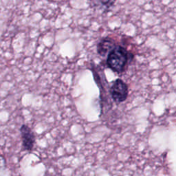  |  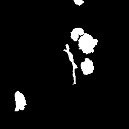 |  

Inferecne Results from CPM17 Dataset
 |      Tissue             | Mask  |  Predicted Mask  |
:-------------------------:|:-------------------------:|:-------------------------:
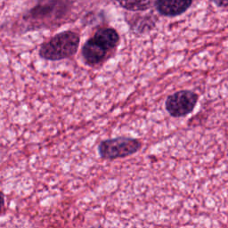  |  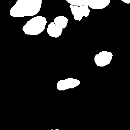 |  

Inferecne Results from Consep Dataset
 |      Tissue             | Mask  |  Predicted Mask  |
:-------------------------:|:-------------------------:|:-------------------------:
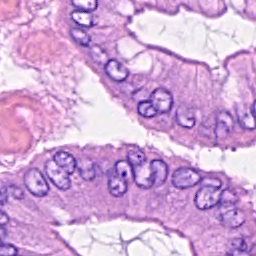  |  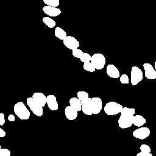 |  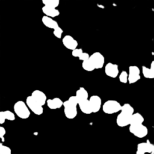

Inferecne Results from Nuclei Segmentation Dataset
 |      Tissue             | Mask  |  Predicted Mask  |
:-------------------------:|:-------------------------:|:-------------------------:
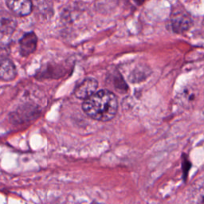  |  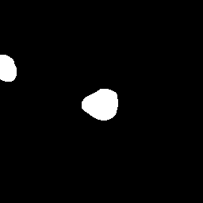 |  

## Quantitative Results

## Training Plots
Model is evaluated on three metrics namely:
* Accuracy
* F1-Score
* Dice Score
### CPM 15
<p float="center">
	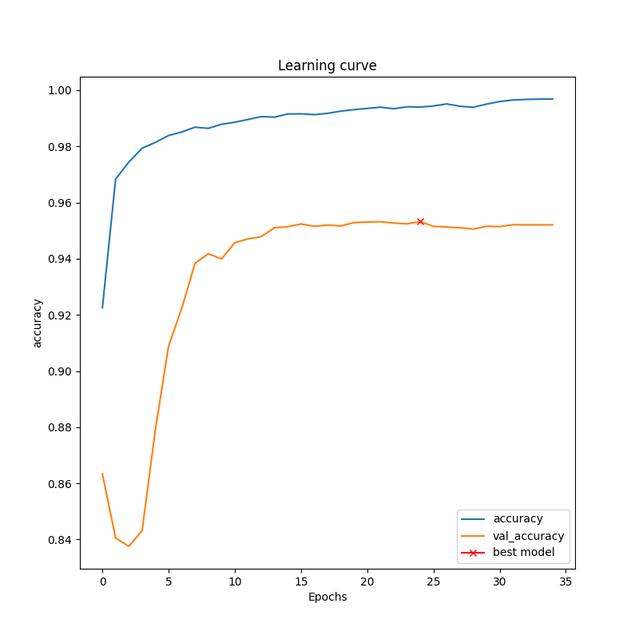
  	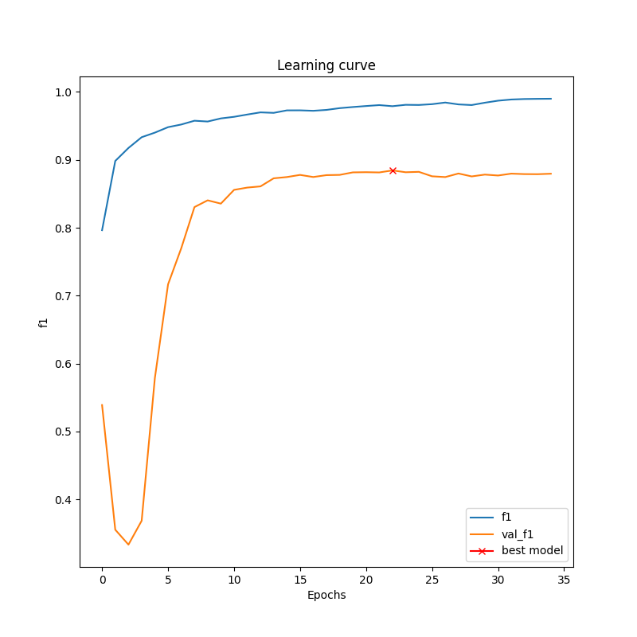
 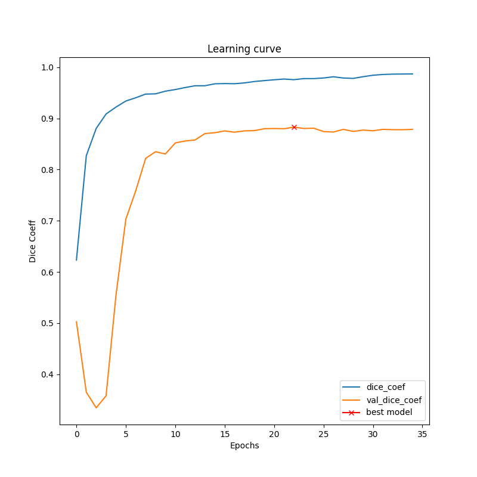
  	
</p>

### CPM 17
<p float="center">
	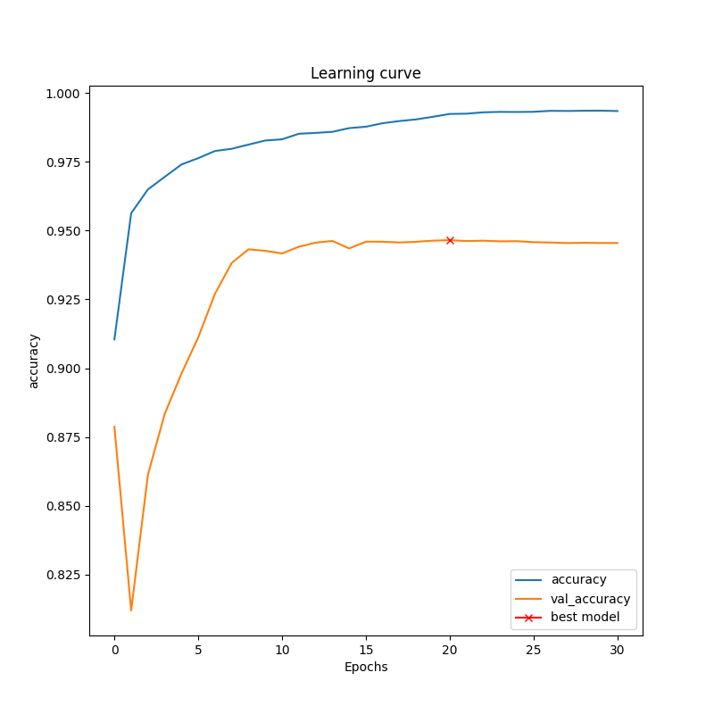
  	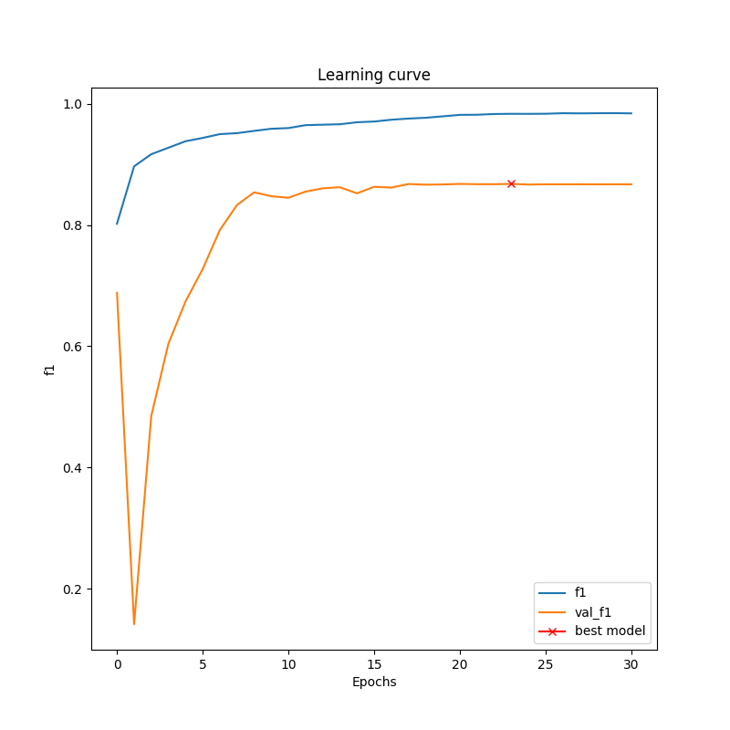
 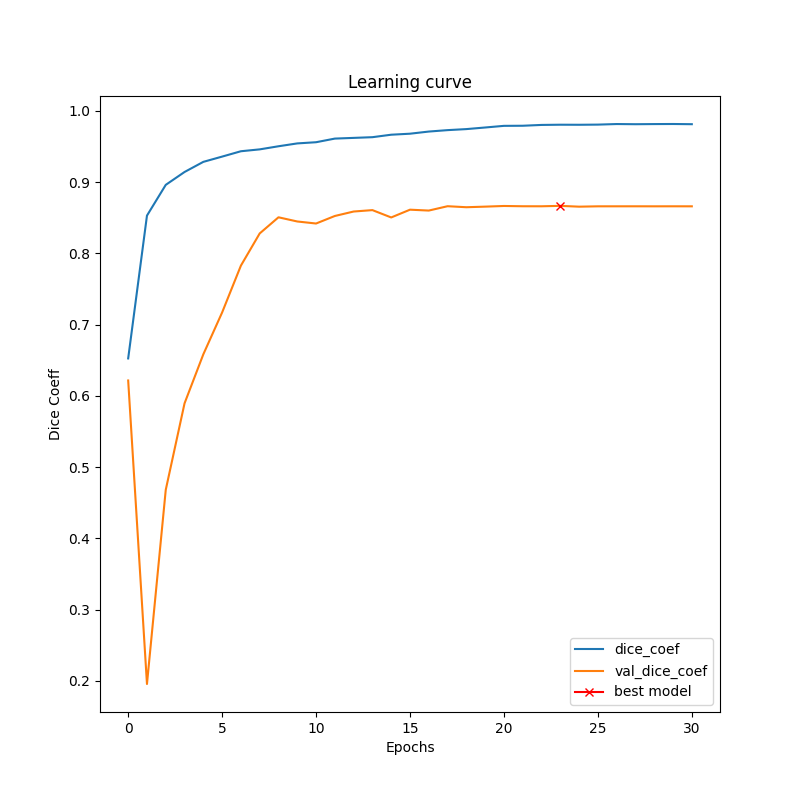
  	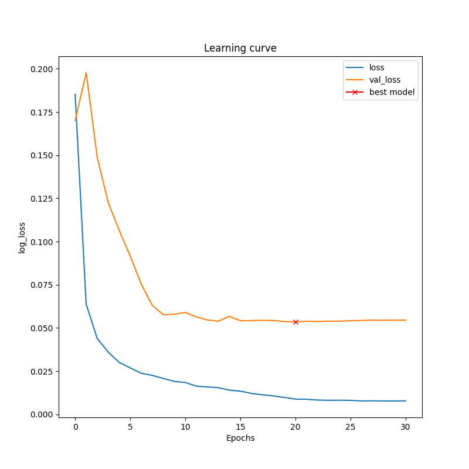
</p>

### Consep
<p float="center">
	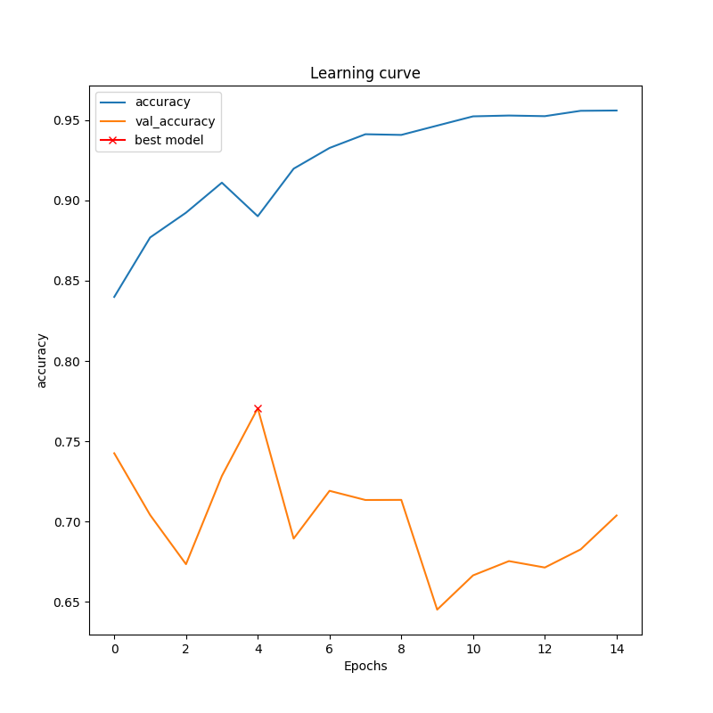
  	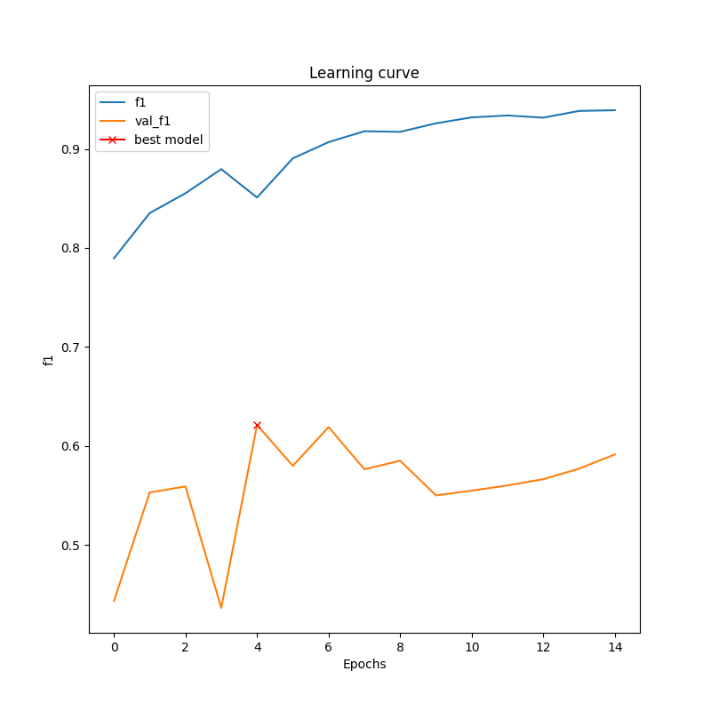
 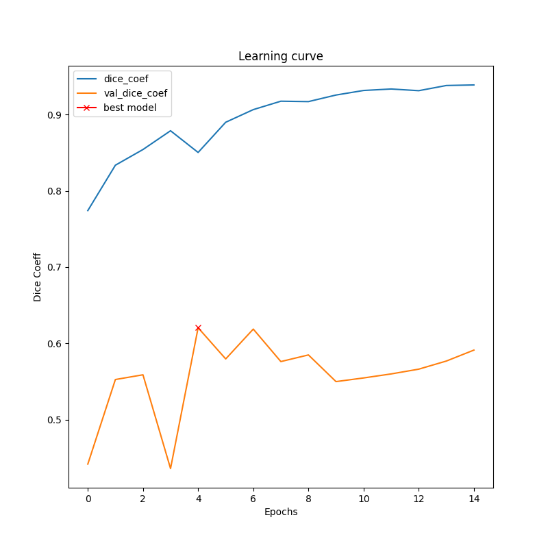
  	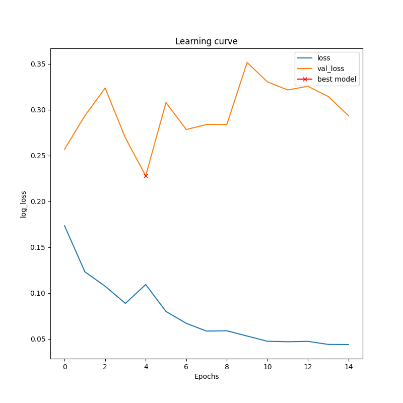
</p>

### Nuclei Segmentation
<p float="center">
	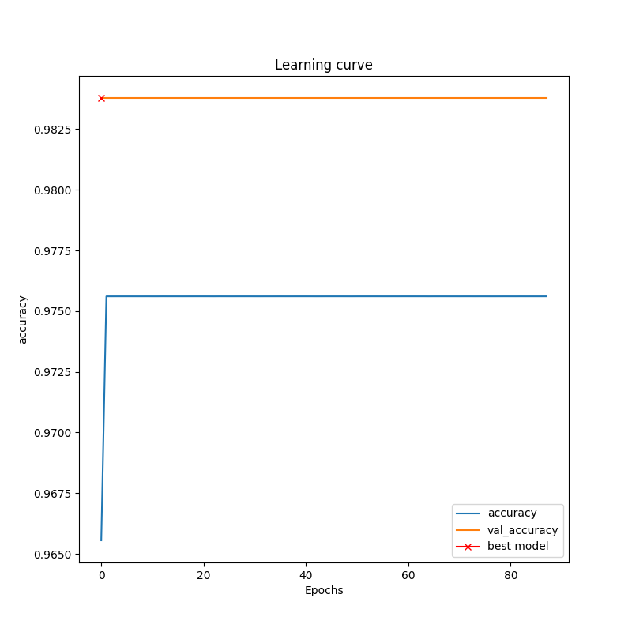
  	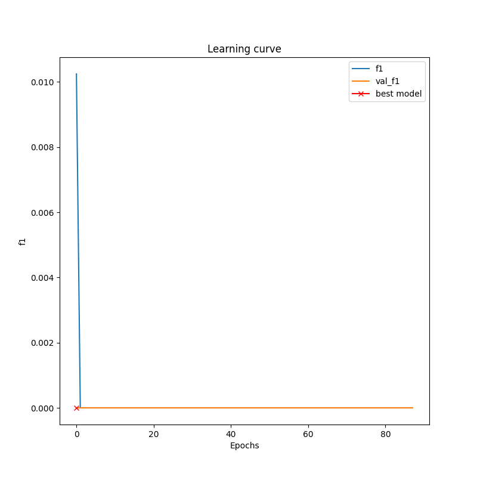
 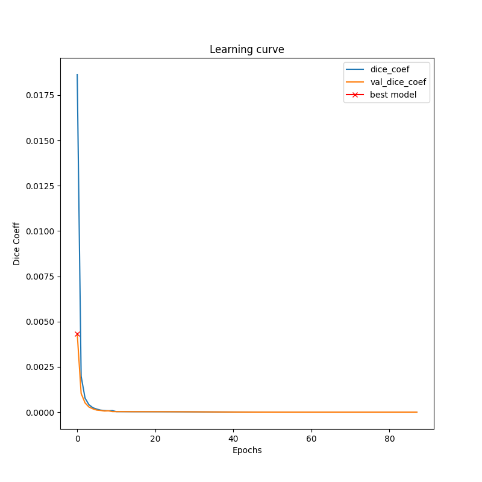
  	
</p>

## Authors
`Maintainer` [Syed Nauyan Rashid](https://https://github.com/nauyan) (nauyan@hotmail.com)
`Maintainer` [Asim Khan Niazi](https://github.com/asimniazi63) (asimhameed.cs@gmail.com)
